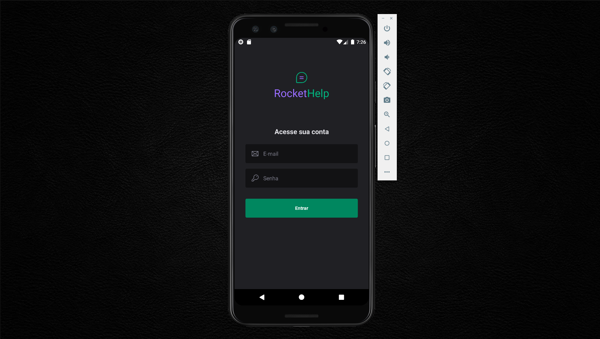
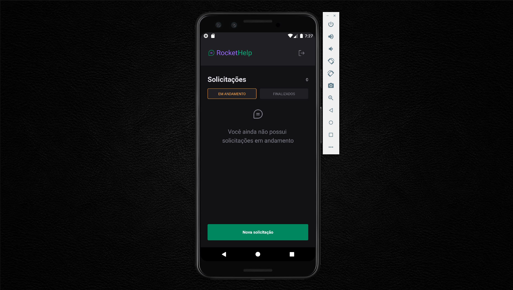
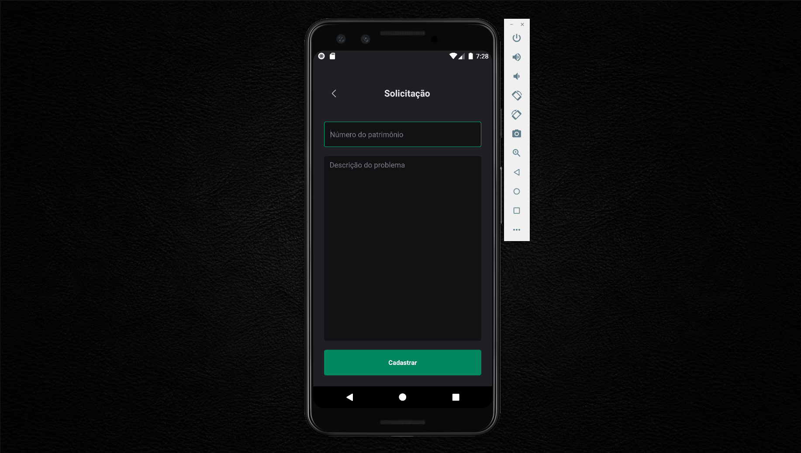
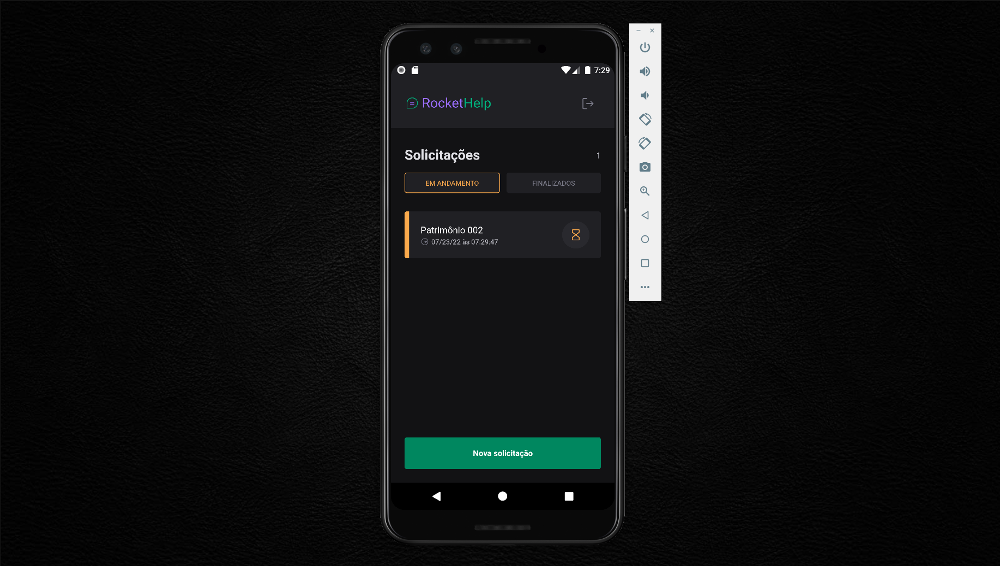
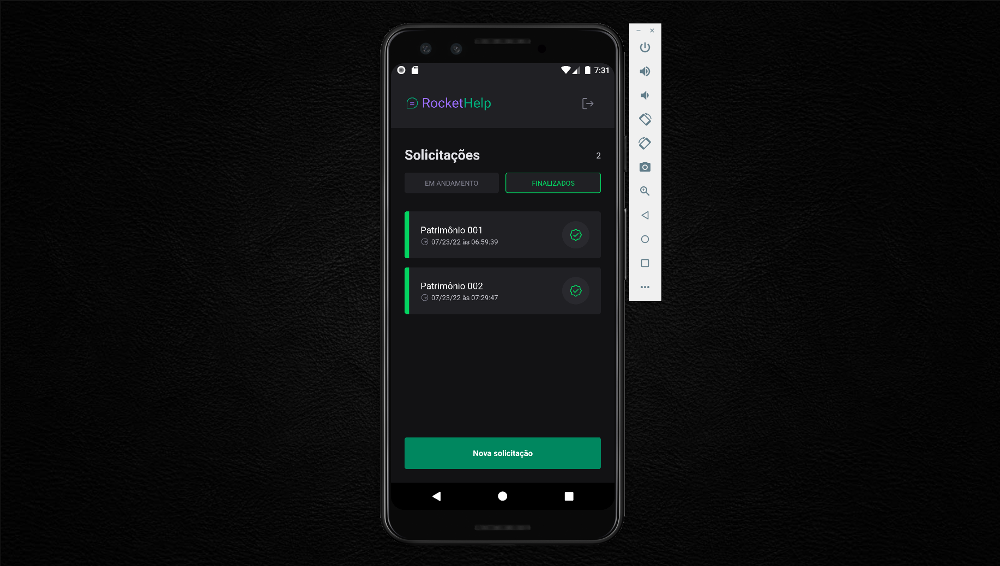
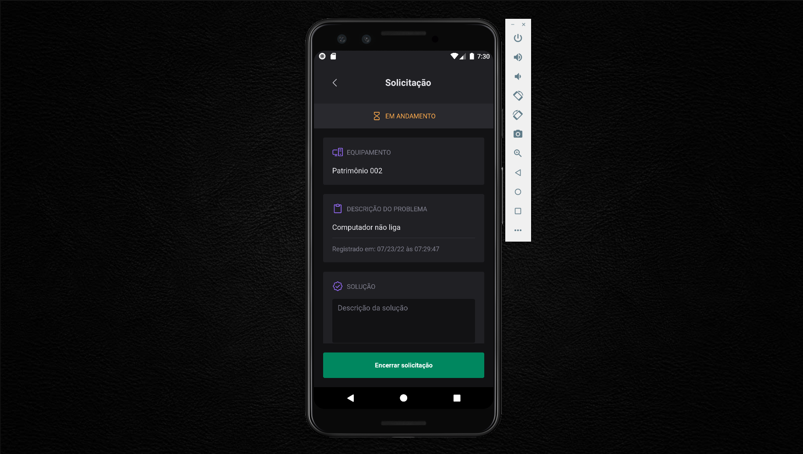
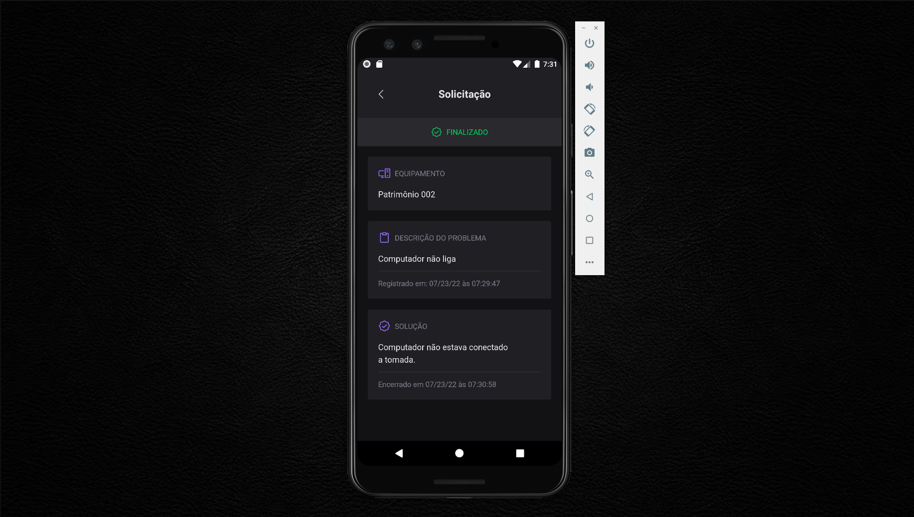

<div>
  <h1 align="center"> 
    
  </h1>
  <h2 align="center"> 
    RocketSeat - Ignite Lab - React Native 🔥
  </h2>
  <h3 align="center"> 
    Application to request maintenance of internal equipment of a company.
  </h3>

  <p align="center">
    <a href="https://rocketseat.com.br">
      
    </a>
    <a href="https://github.com/jorgeeder"> 
      
    </a>
    
    
    <a href="https://opensource.org/licenses/MIT">
      
    </a>
  </p>
</div>

## About The Project

RocketHelp is an Application for requesting maintenance of a company's internal equipment, it was developed during Rocketseat's React Native Ignite Lab, where we had Rodrigo Gonçalves Santana as an instructor.


## Features

- Authentication login with firebase
- Register a maintenance request
- List request in progress
- List resolved requests
- Log out from the session 


## Technologies

-   **[React Native](https://reactnative.dev/)**
-   **[Expo](https://expo.dev/)**
-   **[Native Base](https://nativebase.io/)**
-   **[Phosphor Icons](https://phosphoricons.com/)**
-   **[Fire Base](https://firebase.google.com/)**


## Application in Use

Application layout in  **[Figma](https://www.figma.com/file/M2jZ09bh1QIkrVlw73sAwh/Rocket-Help---Ignite-Lab-(Community)?node-id=37%3A6)**

See on  **[Youtube](https://youtu.be/npJlyd9Vgco)**










## Requirement

-   **[Node.js](https://nodejs.org/)**
-   **[React Native Environment Setup](https://nodejs.org/)**

## Running The Project

```
# You can use npm package manager or yarn to run the commands below

## Clone the repository
git clone git@github.com:jorgeeder/rockethelp.git

## Access the project folder in the terminal
cd rockethelp

## To install dependencies
yarn

## To run the Android project
expo run:android 

## or

## To run the Ios project
expo run:ios
```
## License

This project is under the MIT license. See the [LICENSE](/LICENSE) file for more details.


<div align="center">
  <p> Made with 💜 by <a href="https://github.com/jorgeeder">Jorge Eder</a> </p>
  <p>
    <a href="https://www.linkedin.com/in/jorgeeder/">
      
    </a>
    <a href = "mailto:jorgeeder.dev@gmail.com">
      
    </a>
  </p>
</div>